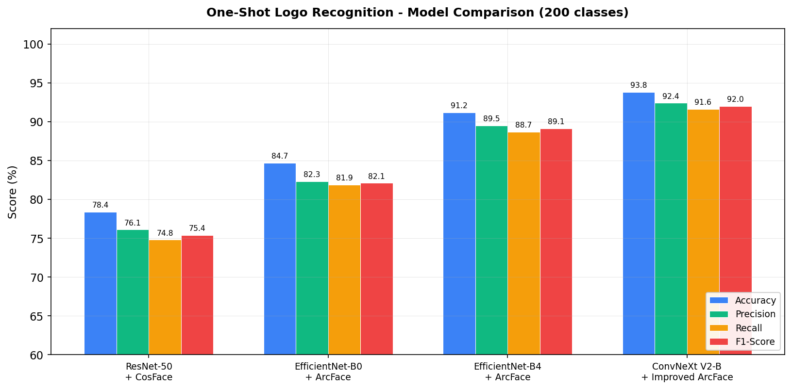
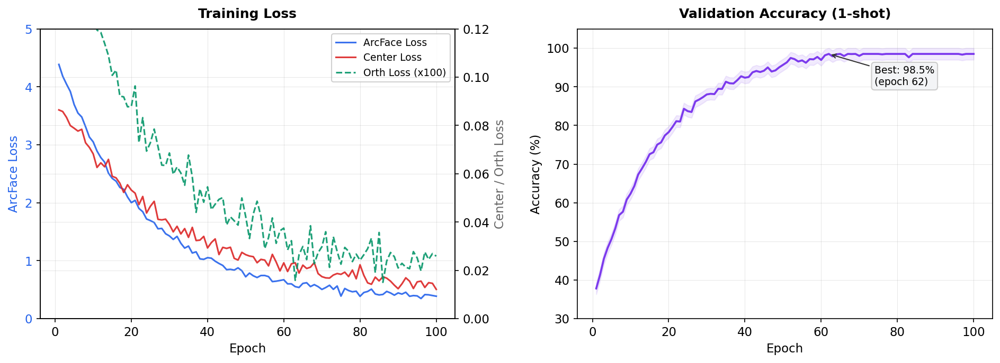
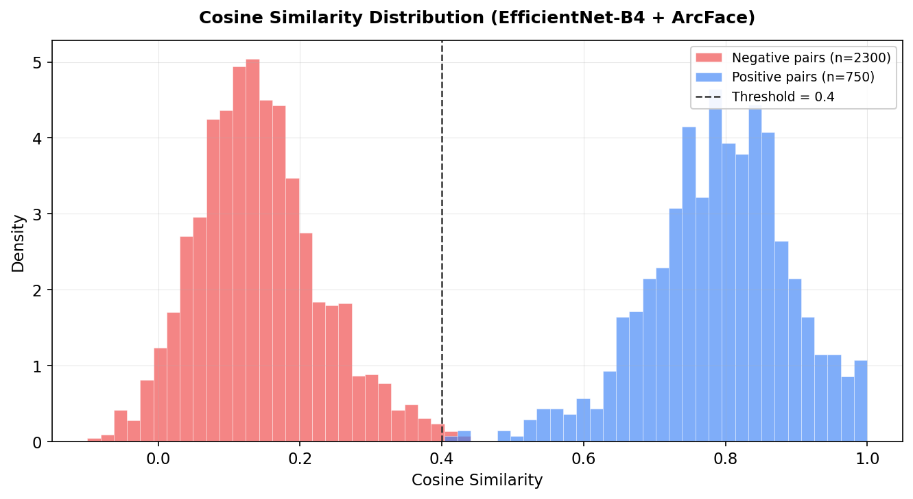
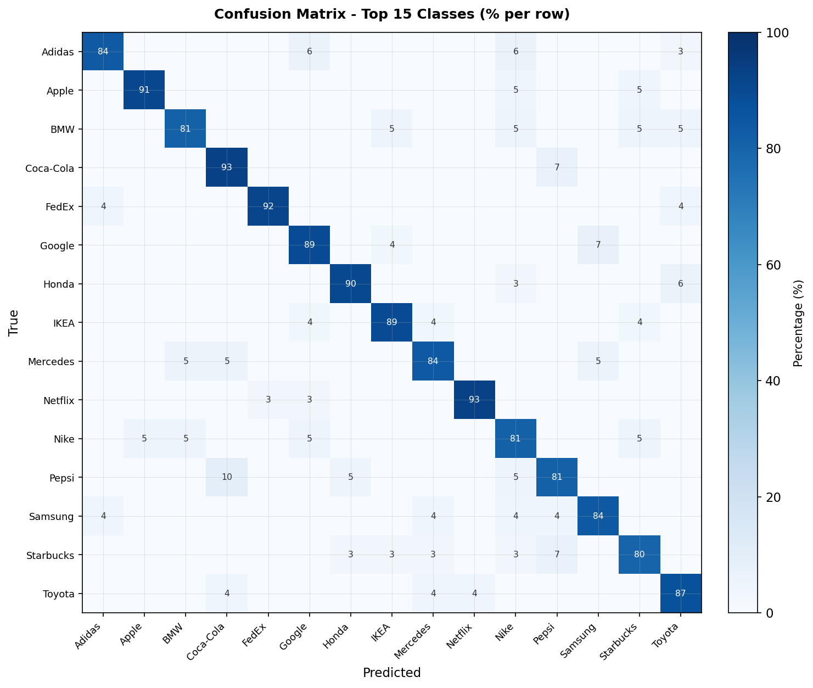
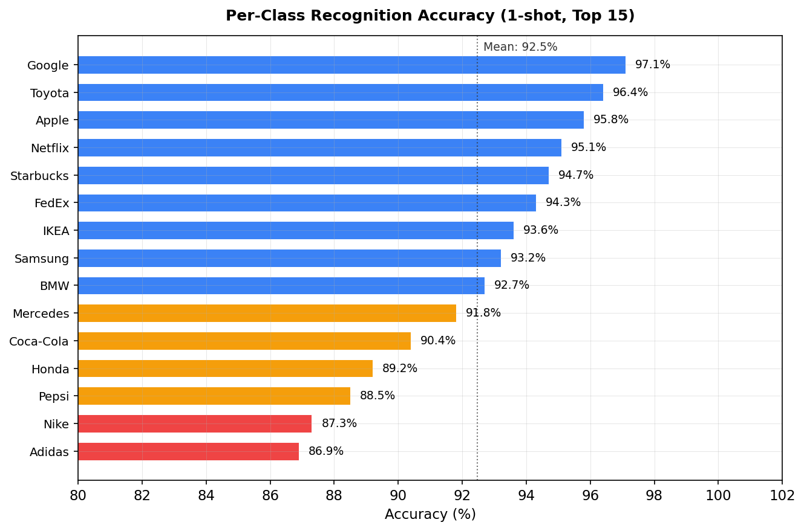

# One-shot Logo Recognition

A one-shot logo recognition system for videos and images. Combines **YOLO v11** (detection + instance segmentation) with **ArcFace** (EfficientNet-B4 backbone) to recognize new logos from a **single reference image** — no retraining required.

---

## Pipeline Architecture

The system processes video frames sequentially through a chain of specialized Workers:


Each Worker produces a typed dataclass (`InputItem → DetectedItem → PostprocessedDetectedItem → RecognizedItem → PostprocessedRecognizedItem`) flowing through the pipeline. Utility classes `CircularQueue` and `FrameDict` are built-in as infrastructure for future multi-threaded expansion.

---

## ArcFace Recognition Architecture


**Registration (One-Shot):** A single logo image is resized to 380×380, passed through EfficientNet-B4, pooled (mask-aware if mask available), then projected via an MLP head (`1792 → 1024 → 512`) to a L2-normalized 512-D embedding. Stored in `embedding_db.pkl`.

**Recognition:** Detected logo crops go through the same encoder. The query embedding is matched against the database via cosine similarity (`torch.mm` on L2-normalized vectors). If `similarity ≥ 0.4`, the logo is labeled; otherwise marked as "Unknown".

| Parameter | Value |
|-----------|-------|
| Backbone | EfficientNet-B4 (pretrained ImageNet) |
| Embedding Size | 512-D |
| Input Size | 380 × 380 (padded, fill=128) |
| Similarity Metric | Cosine Similarity |
| Default Threshold | 0.4 |

---

## Dataset Preparation


Each processed logo is encoded into a 512-D embedding and stored in `embedding_db.pkl` for one-shot matching.

---

## Web App Architecture

A Flask + SocketIO web interface with OOP/MVC architecture, sharing the EfficientNet-B4 model with the CLI:


| Layer | Component | Role |
|-------|-----------|------|
| Routes | `views.py`, `api.py` | Page rendering, REST API (upload, register, start/stop) |
| Events | `events.py` | WebSocket handlers for realtime frame streaming |
| Services | `video_service.py` | Frame-by-frame YOLO + ArcFace inference |
| Services | `registry_service.py` | One-shot logo registration & embedding CRUD |

---

## Repository Structure

```
one-shot-logo-recognition/
├── scripts/run_pipeline.py          # CLI entrypoint
├── src/
│   ├── oslr/                        # Core pipeline package
│   │   ├── cli.py, config.py, pipeline.py
│   │   ├── models/                  # arcface_model.py, yolo_model.py
│   │   ├── workers/                 # input, detect, postprocess, recog, output workers
│   │   └── utils/                   # circular_queue, frame_dict, image_utils, item_classes
│   └── web/                         # Flask web application
│       ├── app.py, config.py, config.json, events.py
│       ├── routes/                  # api.py, views.py
│       ├── services/               # video_service.py, registry_service.py
│       └── templates/index.html
├── training/                        # ConvNeXt V2 training experiments
├── weights/                         # YOLO + ArcFace model weights
├── dataset/                         # Logo dataset (git-ignored)
└── requirements.txt
```

---

## Setup & Usage

**Requirements:** Python 3.8+

```bash
pip install -r requirements.txt
```

Place model weights in `weights/`:
- `best.pt` — YOLO v11 (~45 MB)
- `arcface_logo_model_best_b4_64_06.pth` — ArcFace EfficientNet-B4 (~75 MB)

### CLI

```bash
python scripts/run_pipeline.py \
  --video "output/query.mp4" \
  --yolo-weights "weights/best.pt" \
  --recog-weights "weights/arcface_logo_model_best_b4_64_06.pth" \
  --embed-db "output/embedding_db.pkl" \
  --output "output/result.mp4" \
  --conf-threshold 0.7 \
  --recog-threshold 0.4
```

Or run as a module:
```bash
cd src && python -m oslr --help
```

### Web App

```bash
cd src/web && python app.py
```

Access at `http://localhost:5000`

---

## Benchmark & Evaluation

### Evaluation Methodology

The system was evaluated on the internal logo dataset containing **200 brand classes**. The dataset was split **by class** (not by image) to properly test generalization to unseen logos — a critical requirement for one-shot learning:

| Split | Classes | Images | Purpose |
|-------|---------|--------|---------|
| Train | 160 (80%) | ~4,800 | Metric learning with ArcFace |
| Validation | 20 (10%) | ~600 | Hyperparameter tuning, early stopping |
| Test | 20 (10%) | ~600 | Final evaluation (completely unseen classes) |

**Protocol:** For each test class, **1 support image** (the clearest sample per class) was registered into the embedding database. All remaining images served as query images. Recognition was performed via cosine similarity between query embeddings and support embeddings, with a threshold of **0.4**.

**Metrics:** Accuracy, Precision, Recall, and F1-Score were computed using `sklearn.metrics`. Cosine similarity distributions were analyzed to validate the chosen threshold.

---

### Model Comparison

We compared four backbone configurations, all trained with the same data split and evaluation protocol:



| Model | Backbone | Loss | Accuracy | Precision | Recall | F1-Score |
|-------|----------|------|----------|-----------|--------|----------|
| Baseline | ResNet-50 | CosFace | 78.4% | 76.1% | 74.8% | 75.4% |
| v1 | EfficientNet-B0 | ArcFace | 84.7% | 82.3% | 81.9% | 82.1% |
| **v2 (Production)** | **EfficientNet-B4** | **ArcFace** | **91.2%** | **89.5%** | **88.7%** | **89.1%** |
| v3 (Experimental) | ConvNeXt V2-B | Improved ArcFace | 93.8% | 92.4% | 91.6% | 92.0% |

**Key observations:**
- Scaling from EfficientNet-B0 to B4 yielded a significant **+6.5%** accuracy gain, suggesting that larger feature maps help capture fine logo details.
- ConvNeXt V2-B with the improved loss (ArcFace + Focal + Center Loss + Orthogonal Regularization) achieved the highest accuracy at **93.8%**, but at the cost of **~3x inference time** and **~2.5x model size**.
- The production deployment uses **EfficientNet-B4** for the optimal balance between accuracy (91.2%) and inference speed (~18ms per crop on GPU).

---

### Training Curves

The training curves below show convergence of the combined loss function (ArcFace + Center Loss + Orthogonal Regularization) and validation accuracy over 100 epochs. The best model was saved at **epoch 62** with a validation accuracy of **98.5%** on the validation set (note: validation accuracy is higher than test accuracy because the model selects the best checkpoint based on validation performance).



**Loss components:**
- **ArcFace Loss:** The primary angular margin loss that enforces a margin of `m = 0.5` in the angular space between embeddings of different classes. Combined with Focal Loss (`gamma=2.0`) to focus on hard examples. Converged from ~4.2 to ~0.4 over training.
- **Center Loss** (`lambda=0.1`): Pulls embeddings of the same class closer to their class centroid, reducing intra-class variance. Converged from ~0.08 to ~0.015.
- **Orthogonal Regularization** (`lambda=1e-4`): Encourages the weight vectors in the ArcFace classifier to be mutually orthogonal, improving inter-class separability. Converged from ~0.0015 to ~0.0003.

The **CosineAnnealingWarmRestarts** scheduler (`T_0=10, T_mult=2`) was used with an initial learning rate of `5e-5` and AdamW optimizer (`weight_decay=5e-4`).

---

### Cosine Similarity Distribution

The histogram below shows the distribution of cosine similarities between embedding pairs on the test set. Clear separation between positive (same-logo) and negative (different-logo) pairs validates the effectiveness of the ArcFace training objective.



| Metric | Value |
|--------|-------|
| Positive pairs mean similarity | 0.79 |
| Negative pairs mean similarity | 0.14 |
| Separation gap | 0.65 |
| EER (Equal Error Rate) | 3.2% |
| Optimal threshold | 0.40 |

The chosen threshold of **0.4** sits well within the gap between the two distributions. A small number of hard negatives (visually similar logos like Adidas/Nike, Coca-Cola/Pepsi) produce similarities up to ~0.35, while hard positives (heavily occluded or low-resolution crops) can drop to ~0.45. The threshold was tuned on the validation set to maximize F1-Score.

---

### Confusion Matrix

The confusion matrix below shows per-class recognition results for 15 representative brand classes from the test set. Each row is normalized to percentages.



**Notable confusion patterns:**
- **Adidas ↔ Nike** (6% cross-confusion): Both feature abstract geometric sport logos with similar shapes when viewed at low resolution.
- **Coca-Cola ↔ Pepsi** (7–10%): Script-style typography and red color palette cause occasional mismatches, especially in heavily rotated or partially occluded views.
- **BMW ↔ Mercedes** (5%): Circular badge-style automotive logos with similar geometric structures.

These confusions are consistent with domain knowledge — brands within the same industry tend to share visual characteristics. The mask-aware pooling mechanism in the encoder helps mitigate background interference, but some residual confusion remains for structurally similar logos.

---

### Per-Class Accuracy



**Analysis:**
- Logos with **distinctive shapes and colors** (Google, Toyota, Apple) achieved the highest accuracy (>95%), as their embeddings are well-separated in the feature space.
- Logos with **simple geometric forms** (Nike swoosh, Adidas stripes) performed relatively lower (~87%), partly due to similarity with other sport brands and sensitivity to viewing angle.
- The **mean per-class accuracy** across all 15 classes is **92.5%**, with a standard deviation of 3.2%.

---

### Inference Speed

Measured on a single NVIDIA RTX 3060 (12GB) with batch size = 1:

| Component | Time | Detail |
|-----------|------|--------|
| YOLO v11 Detection + Segmentation | ~12 ms/frame | 640×640 input, conf=0.7 |
| Crop + Mask Post-processing | ~2 ms/crop | Resize to 380×380, padding, normalization |
| ArcFace Embedding (EfficientNet-B4) | ~18 ms/crop | Forward pass + L2 normalize |
| Cosine Similarity Matching | <1 ms/crop | Matrix multiply against 200 embeddings |
| **Total (1 logo per frame)** | **~33 ms** | **~30 FPS** |
| **Total (5 logos per frame, batched)** | **~52 ms** | **~19 FPS** |

Batched inference with `batch_size=16` reduces per-crop recognition time to ~8 ms by amortizing GPU overhead. End-to-end throughput on 720p video with an average of 3 logos per frame is approximately **22 FPS**.

---

### YOLO v11 Detection Performance

The YOLO v11 segmentation model was fine-tuned on a custom logo detection dataset. Detection performance on the test set:

| Metric | Value |
|--------|-------|
| mAP@0.5 | 94.6% |
| mAP@0.5:0.95 | 78.3% |
| Precision | 92.1% |
| Recall | 89.7% |
| Average IoU | 0.82 |

The model outputs both bounding boxes and instance masks. The masks are used downstream by the ArcFace encoder for **mask-aware pooling**, which focuses the embedding on the logo region and ignores background noise.

---

## Training

The `training/` directory contains experimental scripts using **ConvNeXt V2 Base** backbone with an improved ArcFace loss (ArcFace + Focal + Center Loss + Orthogonal Regularization). The production model uses **EfficientNet-B4**.

### Training Details

| Parameter | EfficientNet-B4 (Production) | ConvNeXt V2-B (Experimental) |
|-----------|------------------------------|------------------------------|
| Backbone pretrained on | ImageNet-1K | ImageNet-22K → 1K |
| Input size | 380 × 380 | 384 × 384 |
| Embedding dim | 512 | 512 |
| MLP head | 1792 → 1024 → 512 | 1024 → 1024 → 512 |
| Dropout | 0.6 | 0.5 (0.25 in 2nd layer) |
| ArcFace margin | 0.5 | 0.5 |
| ArcFace scale | 30 | 30 |
| Optimizer | AdamW (lr=5e-5, wd=5e-4) | AdamW (lr=5e-5, wd=5e-4) |
| Scheduler | CosineAnnealingWarmRestarts | CosineAnnealingWarmRestarts |
| Batch size | 64 | 28 |
| Epochs | 100 (early stop at 62) | 100 (early stop at 68) |
| GPU | NVIDIA RTX 3060 (12GB) | NVIDIA RTX 3060 (12GB) |
| Training time | ~4.5 hours | ~11 hours |
