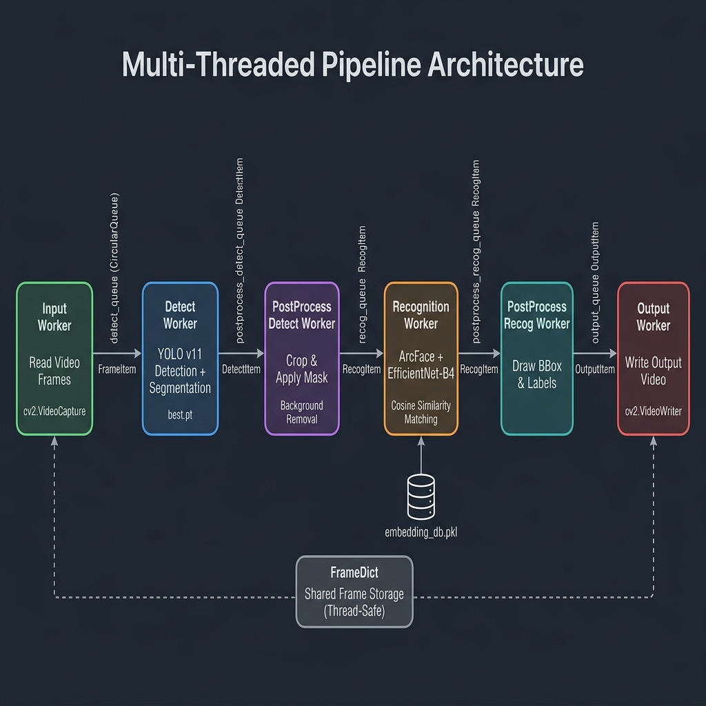
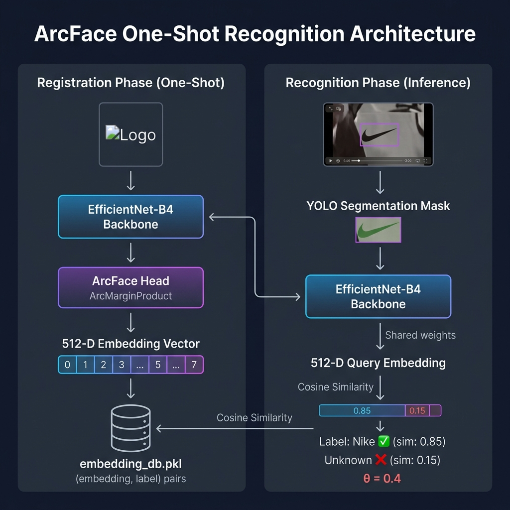
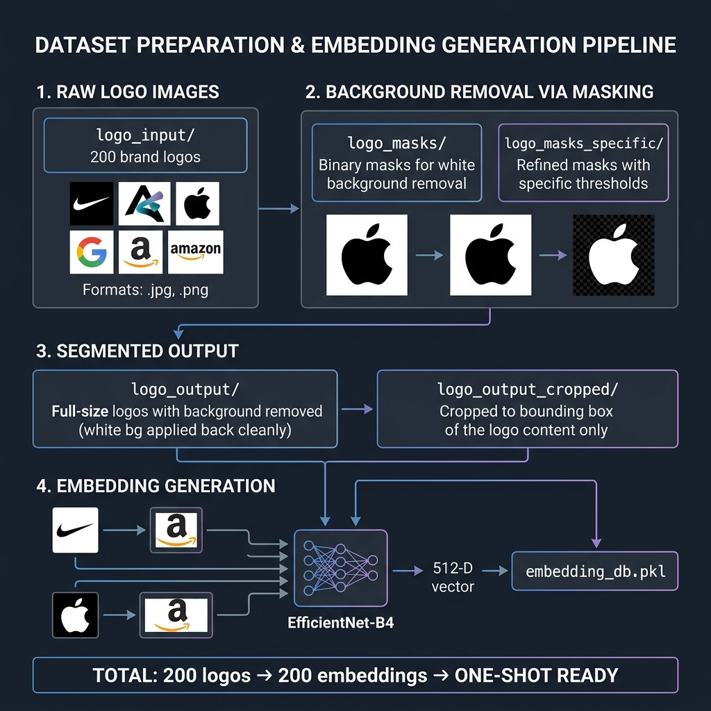
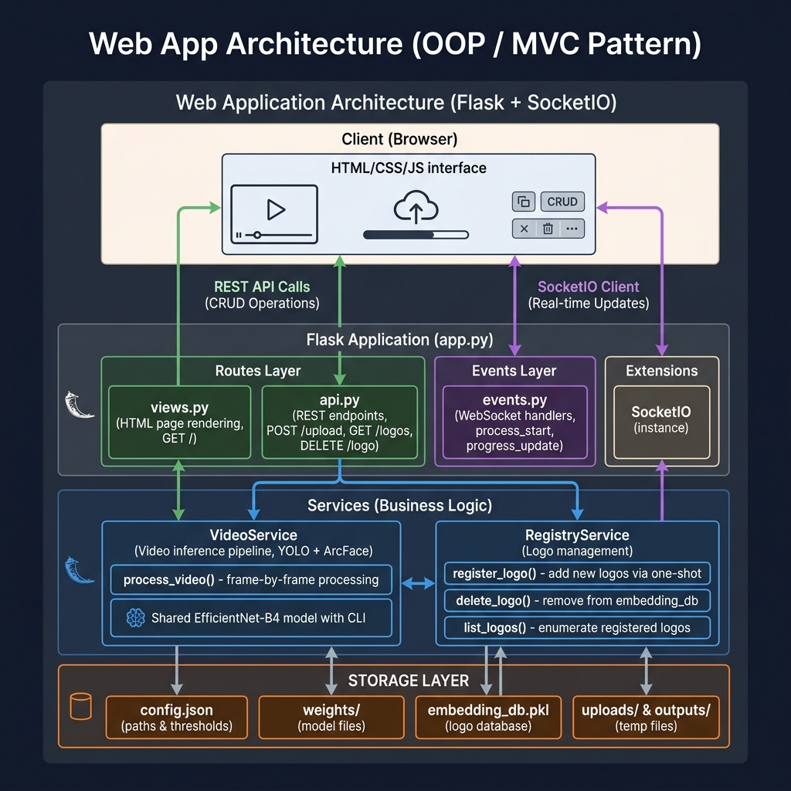

# One-shot Logo Recognition

A one-shot logo recognition system for videos and images. Combines **YOLO v11** (detection + instance segmentation) with **ArcFace** (EfficientNet-B4 backbone) to recognize new logos from a **single reference image** — no retraining required.

---

## Pipeline Architecture

The system processes video frames sequentially through a chain of specialized Workers:



```
Video → InputWorker → DetectWorker (YOLO v11) → PostProcessDetectWorker (Crop + Mask)
    → RecogWorker (ArcFace Matching) → PostProcessRecogWorker (Draw Results) → OutputWorker → Output Video
```

Each Worker produces a typed dataclass (`InputItem → DetectedItem → PostprocessedDetectedItem → RecognizedItem → PostprocessedRecognizedItem`) flowing through the pipeline. Utility classes `CircularQueue` and `FrameDict` are built-in as infrastructure for future multi-threaded expansion.

---

## ArcFace Recognition Architecture



**Registration (One-Shot):** A single logo image is resized to 380×380, passed through EfficientNet-B4, pooled (mask-aware if mask available), then projected via an MLP head (`1792 → 1024 → 512`) to a L2-normalized 512-D embedding. Stored in `embedding_db.pkl`.

**Recognition:** Detected logo crops go through the same encoder. The query embedding is matched against the database via cosine similarity (`torch.mm` on L2-normalized vectors). If `similarity ≥ 0.4`, the logo is labeled; otherwise marked as "Unknown".

| Parameter | Value |
|-----------|-------|
| Backbone | EfficientNet-B4 (pretrained ImageNet) |
| Embedding Size | 512-D |
| Input Size | 380 × 380 (padded, fill=128) |
| Similarity Metric | Cosine Similarity |
| Default Threshold | 0.4 |

---

## Dataset Preparation



The `dataset/` directory contains 200 brand logos processed through a background removal pipeline:

```
logo_input/ (200 raw logos) → logo_masks/ (binary masks) → logo_output/ (bg removed)
                            → logo_masks_specific/         → logo_output_cropped/ (tight crop)
```

Each processed logo is encoded into a 512-D embedding and stored in `embedding_db.pkl` for one-shot matching.

---

## Web App Architecture

A Flask + SocketIO web interface with OOP/MVC architecture, sharing the EfficientNet-B4 model with the CLI:



| Layer | Component | Role |
|-------|-----------|------|
| Routes | `views.py`, `api.py` | Page rendering, REST API (upload, register, start/stop) |
| Events | `events.py` | WebSocket handlers for realtime frame streaming |
| Services | `video_service.py` | Frame-by-frame YOLO + ArcFace inference |
| Services | `registry_service.py` | One-shot logo registration & embedding CRUD |

---

## Repository Structure

```
one-shot-logo-recognition/
├── scripts/run_pipeline.py          # CLI entrypoint
├── src/
│   ├── oslr/                        # Core pipeline package
│   │   ├── cli.py, config.py, pipeline.py
│   │   ├── models/                  # arcface_model.py, yolo_model.py
│   │   ├── workers/                 # input, detect, postprocess, recog, output workers
│   │   └── utils/                   # circular_queue, frame_dict, image_utils, item_classes
│   └── web/                         # Flask web application
│       ├── app.py, config.py, config.json, events.py
│       ├── routes/                  # api.py, views.py
│       ├── services/               # video_service.py, registry_service.py
│       └── templates/index.html
├── training/                        # ConvNeXt V2 training experiments
├── weights/                         # YOLO + ArcFace model weights
├── dataset/                         # Logo dataset (git-ignored)
└── requirements.txt
```

---

## Setup & Usage

**Requirements:** Python 3.8+

```bash
pip install -r requirements.txt
```

Place model weights in `weights/`:
- `best.pt` — YOLO v11 (~45 MB)
- `arcface_logo_model_best_b4_64_06.pth` — ArcFace EfficientNet-B4 (~75 MB)

### CLI

```bash
python scripts/run_pipeline.py \
  --video "output/query.mp4" \
  --yolo-weights "weights/best.pt" \
  --recog-weights "weights/arcface_logo_model_best_b4_64_06.pth" \
  --embed-db "output/embedding_db.pkl" \
  --output "output/result.mp4" \
  --conf-threshold 0.7 \
  --recog-threshold 0.4
```

Or run as a module:
```bash
cd src && python -m oslr --help
```

### Web App

```bash
cd src/web && python app.py
```

Access at `http://localhost:5000`

---

## Training

The `training/` directory contains experimental scripts using **ConvNeXt V2 Base** backbone with an improved ArcFace loss (ArcFace + Focal + Center Loss + Orthogonal Regularization). The production model uses **EfficientNet-B4**.
